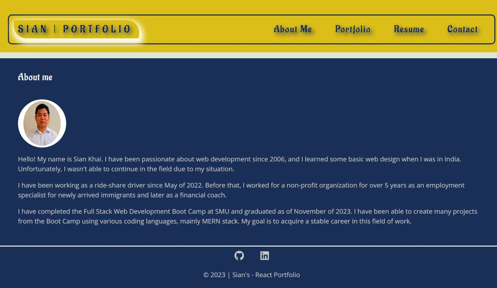
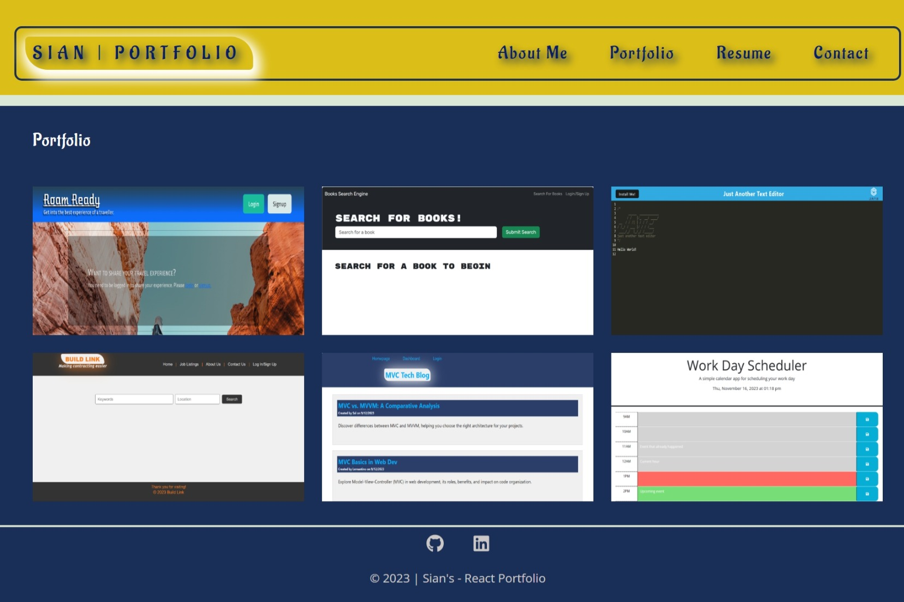
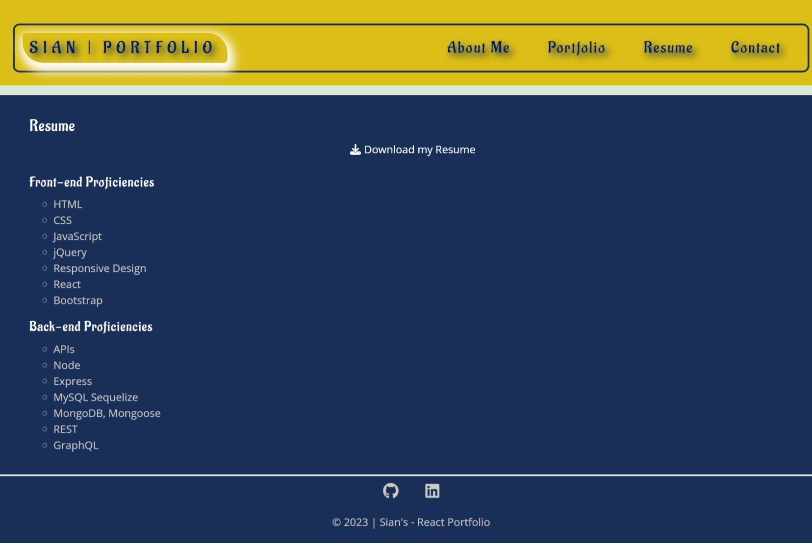
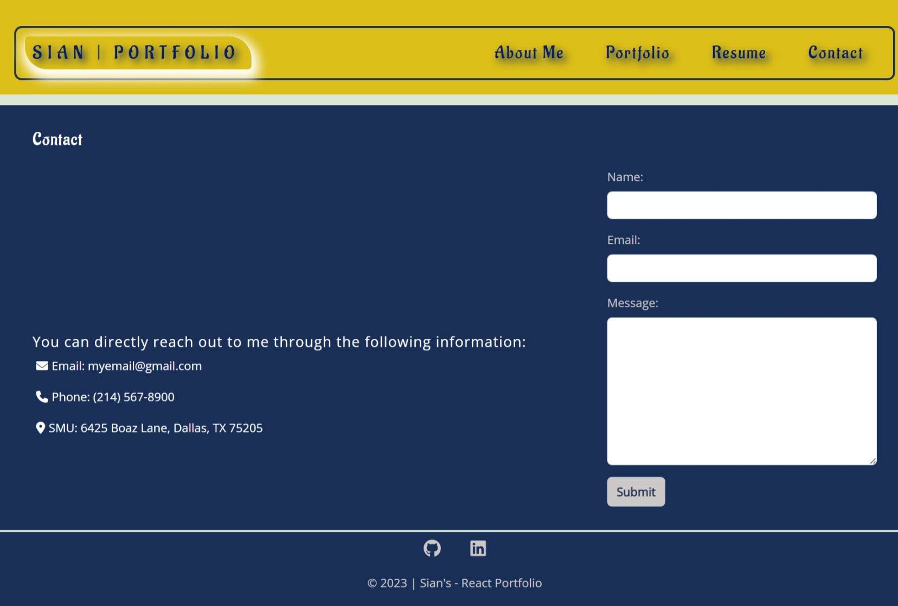

# Sian React Portfolio

[](https://app.netlify.com/sites/sian-react-portfolio/deploys)

## User Story

```md
AS AN employer looking for candidates with experience building single-page applications
I WANT to view a potential employee's deployed React portfolio of work samples
SO THAT I can assess whether they're a good candidate for an open position
```

## Acceptance Criteria

```md
GIVEN a single-page application portfolio for a web developer
WHEN I load the portfolio
THEN I am presented with a page containing a header, a section for content, and a footer
WHEN I view the header
THEN I am presented with the developer's name and navigation with titles corresponding to different sections of the portfolio
WHEN I view the navigation titles
THEN I am presented with the titles About Me, Portfolio, Contact, and Resume, and the title corresponding to the current section is highlighted
WHEN I click on a navigation title
THEN the browser URL changes and I am presented with the corresponding section below the navigation and that title is highlighted
WHEN I load the portfolio the first time
THEN the About Me title and section is presented on the top of the page
WHEN I am presented with the About Me section
THEN I see a photo of the developer and a short bio about them
WHEN I scroll down to the Portfolio section of the page
THEN I see titled images of six of the developer’s applications with links to both the deployed applications and the corresponding GitHub repositories
WHEN I scroll down to the next section
THEN I see a contact form with fields for a name, an email address, and a message
WHEN I click the submit button without entering text in one of the form fields
THEN I receive a notification that this field is required
WHEN I enter text into the email address field
THEN I receive a notification if I have entered an invalid email address
WHEN I scroll down to the Resume section
THEN I see a link to a downloadable resume, certificate, and a list of the developer’s proficiencies
WHEN I view the footer
THEN I am presented with text or icon links to the developer’s GitHub and LinkedIn profiles
```

## Table of Contents

- [Description](#description)
- [Technologies](#technologies)
- [Installation](#installation)
- [Usage](#usage)
- [Screenshots](#screenshots)

## Description

Being a web developer means being part of a community. I need a place not only to share my projects while
I am applying for jobs or working as a freelancer but also to share my work with other developers and collaborate on projects.
I build this portfolio using my React skills, which will help set me apart from other developers whose portfolios don’t use the latest technologies.

## Technologies

- Bootstrap/CSS
- Express.js
- Heroku
- JavaScript
- Netlify
- Node.js
- React
- Vite

## Installation

In order to be able to run the application, you are required to do the following:

- Download the zip file/ clone the GitHub repo
- Open the folder in VSCode
- Click the "Toggle Panel" on the right-side or "Ctrl+J" to see the Terminal or Command Line Interface(CLI)
- Install npm (Node Package Manager) inside the repo by typing the following code in the Command Line:

```
    npm install               Press Enter
```

## Usage

To use the application,

- You need to do, "npm install" if you haven't done in the Installation section above.
- Type the following commands in the Command Line to run application on your computer:

```
    npm start               Press Enter
```

- The application is deployed on Netlify. Visit the live website by [clicking here](https://sian-react-portfolio.netlify.app/).

## Screenshots

- Page "`About Me`":



- Page "`Portfolio`":



- Page "`Resume`":



- Page "`Contact`":


